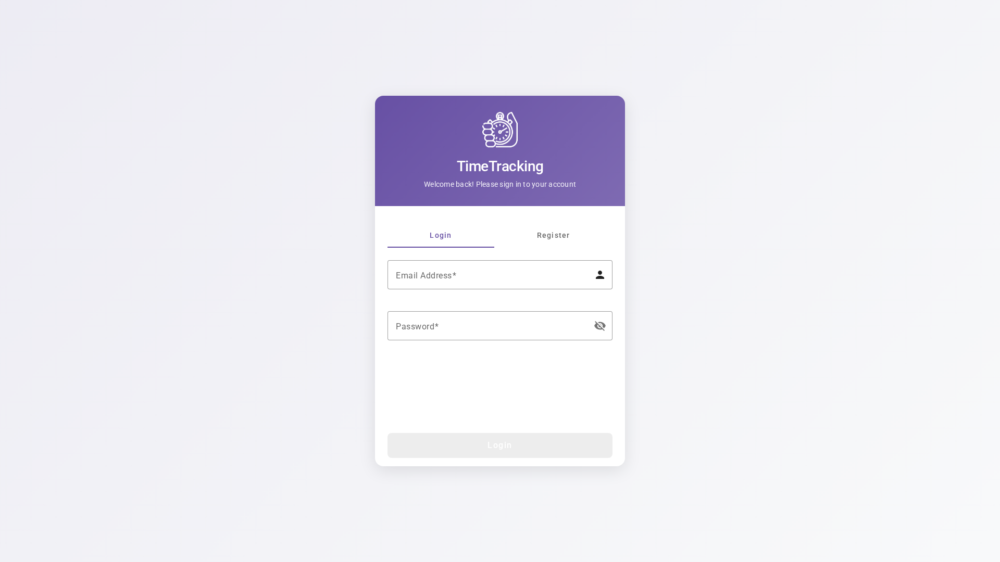
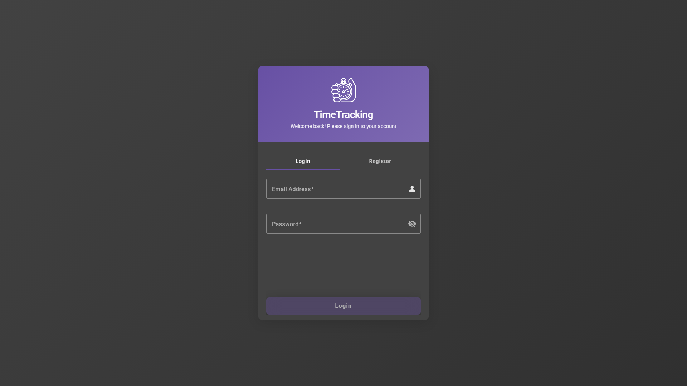
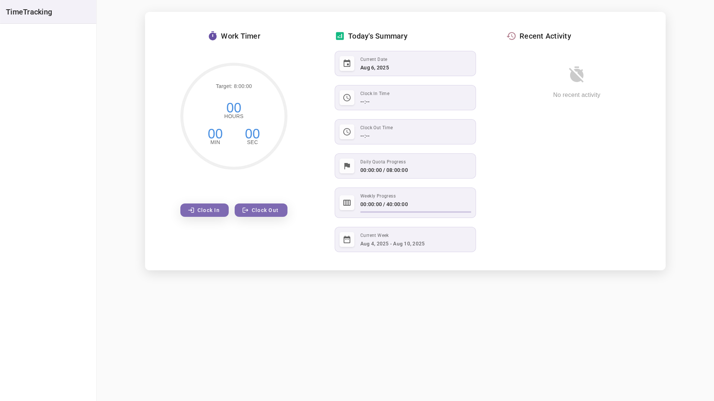
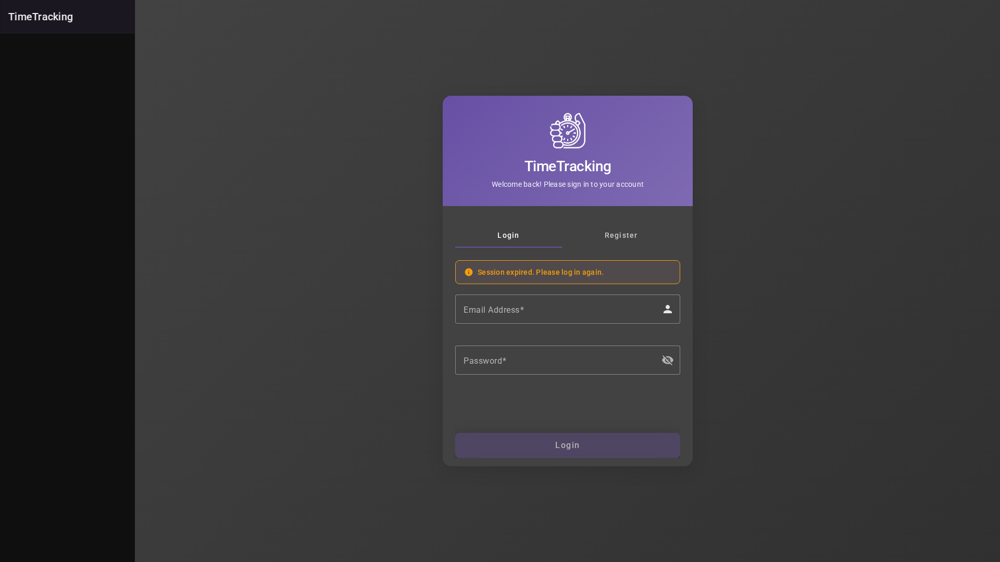
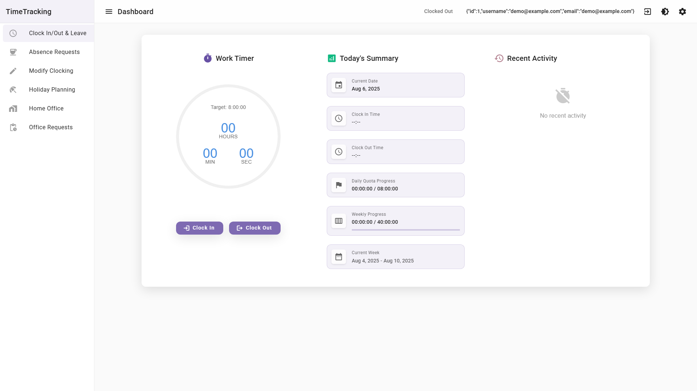
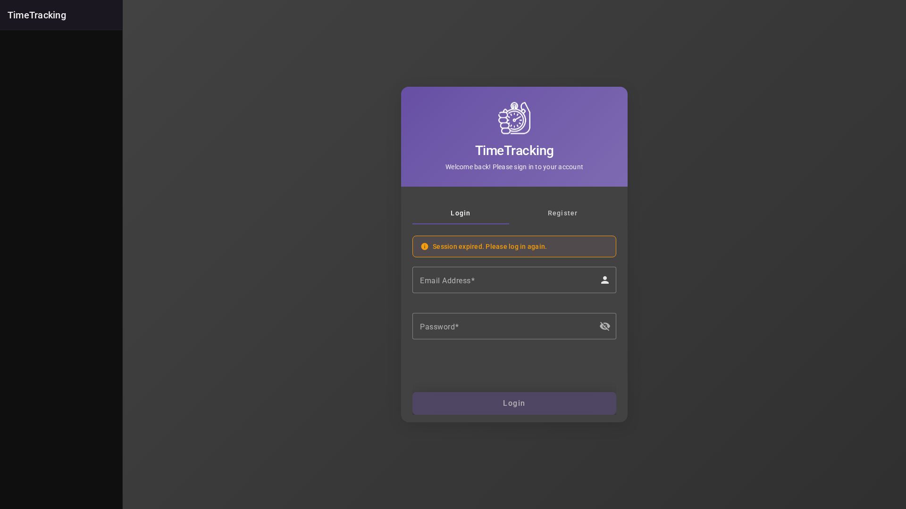

# TechTrek Time Tracking

## Project Structure

The project is organized as a monorepo (no nx) with two main parts:

-   `client/`: Contains the Angular frontend application.
-   `backend/`: Contains the NestJS backend API.

## Technology Stack

-   **Frontend (Client):**
    -   Angular
    -   TypeScript
    -   Angular Material
    -   OpenLayers (for maps)
    -   FullCalendar
    -   SCSS
-   **Backend:**
    -   NestJS
    -   TypeScript
    -   TypeORM
    -   SQLite


## Screenshots

### Login Page
| Light Mode | Dark Mode |
|------------|-----------|
|  |  |

### Clock In/Out Page
| Light Mode | Dark Mode |
|------------|-----------|
|  |  |

### Holiday Planning Page
| Light Mode | Dark Mode |
|------------|-----------|
|  |  |

*Screenshots are automatically updated on every client code change.*


## Setup and Running

**Prerequisites:**

-   Node.js (v18 or later recommended)
-   npm or yarn

**Backend Setup:**

1.  Navigate to the backend directory:
    ```bash
    cd backend
    ```
2.  Install dependencies:
    ```bash
    npm install
    # or
    yarn install
    ```
3.  Run the backend server in development mode (with hot-reloading):
    ```bash
    npm run start:dev
    # or
    yarn start:dev
    ```
    The backend API will be available at `http://localhost:3000`.

4.  Setup a .env file at the root of the backend folder with the following structure.
    ```bash
    # Database Configuration
    DB_TYPE=postgres
    DB_HOST=<your-host-url>
    DB_PORT=<your-port>
    DB_USERNAME=<your-db-user>
    DB_PASSWORD=<your-password>
    DB_DATABASE=<your-database-name>

    # JWT Configuration
    JWT_SECRET=<your-super-secret-jwt-key-here>
    JWT_EXPIRES_IN=<your-expire-time>

    # Application Configuration
    NODE_ENV=development
    PORT=3000
    ```

**Client Setup:**

1.  Navigate to the client directory:
    ```bash
    cd client
    ```
2.  Install dependencies:
    ```bash
    npm install
    # or
    yarn install
    ```
3.  Run the Angular development server:
    ```bash
    ng serve
    ```
    The frontend application will be available at `http://localhost:4200/`. The app will automatically reload if you change any of the source files.

## Key Features

-   User Authentication
-   Clock In/Out functionality
-   Absence Request Management
-   Clocking Modification
-   Holiday Planning Overview
-   Home Office Management (defining locations via map, requesting home office days)
-   User Preferences
-   E2E and Unit testing
-   Full dark mode support

## Deployment and CI/CD

This project uses GitHub Actions for automated deployment and continuous integration. There are two main workflows:

### 1. Backend Deployment (`nestjs-deploy.yml`)

**Triggers:**
- Push to `main` branch with changes in the `backend/` directory
- Manual workflow dispatch

**Process:**
1. **Build and Test**: Installs dependencies, runs linting, builds the NestJS application, and runs tests
2. **Automatic Deployment**: The backend is automatically deployed to Railway when changes are pushed
3. **Frontend Notification**: After successful backend deployment, triggers the Angular deployment workflow with the updated backend URL

**Configuration Required:**
- Set `BACKEND_URL` in repository variables (Settings → Secrets and variables → Actions → Variables)
- Railway integration for automatic backend deployment

### 2. Frontend Deployment (`deploy-to-gh-pages.yml`)

**Triggers:**
- Push to `main` branch
- Pull requests to `main` branch
- Manual workflow dispatch
- Repository dispatch event (triggered by backend deployment)

**Process:**
1. **Build**: Installs dependencies and builds the Angular application for GitHub Pages
2. **Environment Configuration**: Dynamically replaces the `BACKEND_URL_PLACEHOLDER` in the environment file with the actual backend URL
3. **Deploy**: Deploys the built application to GitHub Pages

**Features:**
- **Dynamic Backend URL**: Automatically uses the correct backend URL from repository variables or secrets
- **Protocol Validation**: Ensures the backend URL includes the proper HTTPS protocol
- **GitHub Pages Optimization**: Creates `.nojekyll` file and deploys to the correct directory structure

### Environment Configuration

The project uses different environment files:
- `environment.github-pages.ts`: Used for GitHub Pages deployment with dynamic backend URL replacement
- Backend URL is configured through repository variables or secrets

### Setting Up Deployment

1. **Repository Variables**: Set `BACKEND_URL` in your GitHub repository settings
2. **Railway Integration**: Connect your Railway account for backend deployment
3. **GitHub Pages**: Enable GitHub Pages in repository settings with GitHub Actions as the source

### CORS Configuration

The backend is configured to accept requests from:
- Local development (`http://localhost:4200`, `http://127.0.0.1:4200`)
- GitHub Pages (`https://ccc909.github.io`, `https://*.github.io`)

